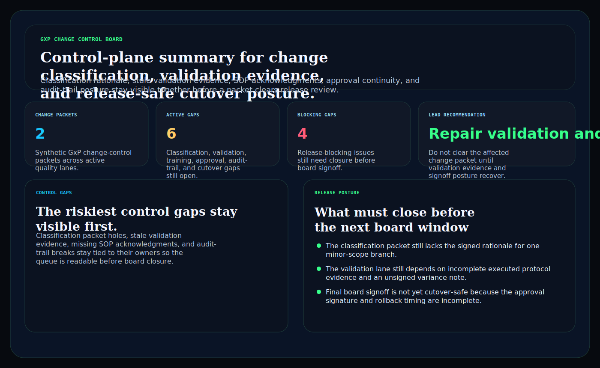
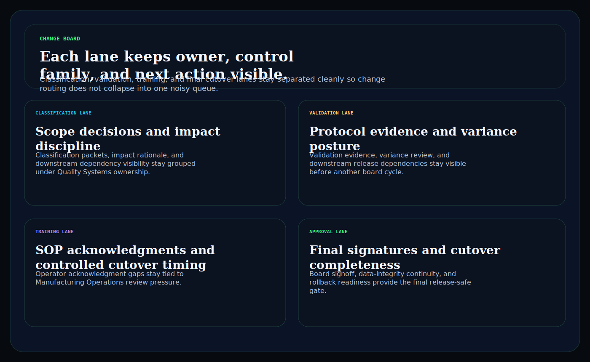
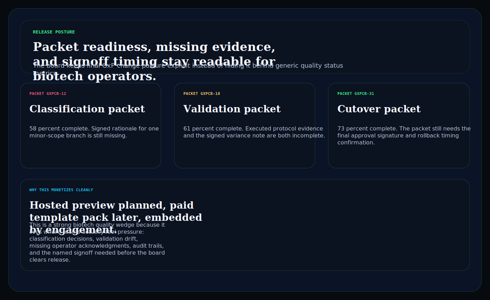

# gxp-change-control-board

C# / ASP.NET operator surface for biotech GxP change packets, validation evidence gaps, approval continuity, and release-safe cutover posture.

## Why this matters

Biotech and diagnostics teams do not need another vague compliance landing page. They need a board that keeps change classification, validation evidence, SOP acknowledgments, approval continuity, audit trails, and cutover readiness visible together before weak packets slip into downstream release review.

This repo is the public proof surface for that pattern:

- `Hosted preview planned` for a browser-based GxP change-control board
- `Embedded by engagement` for teams that need the routing model inside a regulated lab or diagnostics workflow

## What it includes

- ASP.NET Core minimal API in C#
- synthetic GxP change snapshots, control gaps, and release packets
- operator surfaces for:
  - `/change-board`
  - `/control-gaps`
  - `/release-posture`
  - `/verification`
  - `/docs`
- structured JSON endpoints under `/api/*`
- static Pages export with `robots.txt`, `sitemap.xml`, and `CNAME`

## Product depth

This is not just a static proof page. It models the operating questions a biotech quality, validation, technical operations, or diagnostics leader needs answered before a change packet reaches release review:

- Which change lanes are blocked by classification rationale, validation evidence, SOP acknowledgement freshness, approval continuity, audit-trail repair, or cutover readiness?
- Who owns the next remediation step, and which board packet is affected?
- Which blockers are release-critical versus acceptable operating pressure?
- What story can leadership tell without overstating compliance status or exposing regulated data?

## What these repos have in common

Kinetic Gain proof surfaces follow the same product pattern: `risk`, `owner`, `proof`, and `next action`.

- `risk` is explicit instead of buried in a generic status update
- `owner` remains attached to each route, packet, or lane
- `proof` is inspectable through screenshots, static HTML, sample payloads, and API routes
- `next action` is written for board, operator, and GTM readability

## Operating workflow

1. Model the change lane: classify the synthetic packet and capture the affected release surface.
2. Attach evidence posture: connect validation gaps, SOP readiness, approval continuity, and audit-trail integrity.
3. Route the decision: identify the accountable owner, blocker severity, and release-safe next action.

## Screenshots





## Verification

- synthetic GxP change-control evidence only
- no patient, clinician, or proprietary biotech secrets
- no claim of GMP, GxP, FDA, or clinical compliance
- this is a control-plane proof surface for biotech workflow depth, not a compliance certification claim

## Local run

```powershell
dotnet test
dotnet run --project src/GxpChangeControlBoard.Api -- --demo
dotnet run --project src/GxpChangeControlBoard.Api
```

Then open:

- `http://127.0.0.1:5094/`
- `http://127.0.0.1:5094/change-board`
- `http://127.0.0.1:5094/control-gaps`
- `http://127.0.0.1:5094/release-posture`

## Render static site

```powershell
dotnet run --project src/GxpChangeControlBoard.Api -- --prerender
```

## Related docs

- [Embedded framing](./docs/KINETIC_GAIN_EMBEDDED.md)
- [Origin story](./docs/ORIGIN.md)
